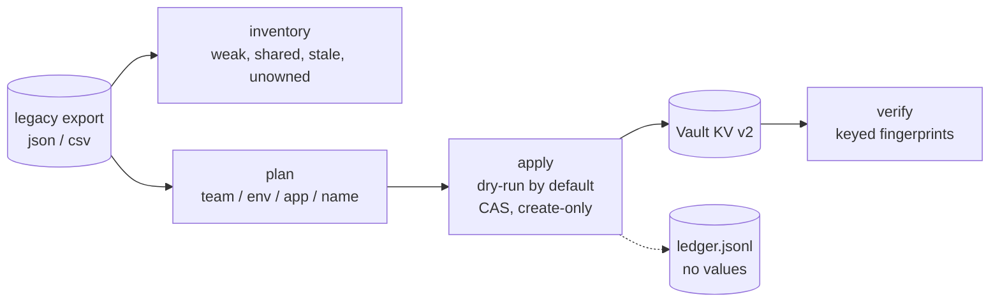

# vault-migration-toolkit

[](https://github.com/ftonita/vault-migration-toolkit/actions)


A careful, resumable way to move secrets from a legacy store into **HashiCorp Vault KV v2**: find the problems first, map every secret to a team- and environment-scoped path, write with check-and-set, then prove the result matches. **It never prints, logs or reports a secret value.**

> **All data in this repository is synthetic.** The demo generator produces obviously fake values (`SYNTHETIC-...`). This is a reference design for the migration approach used on multi-team Vault rollouts, not code or data from any employer.

## Workflow



| Step | What it guarantees |
|---|---|
| `inventory` | Needs no Vault access. Flags weak values, the **same value reused across environments** (high severity when prod is involved), duplicates, stale and unowned secrets. Compared via HMAC fingerprints, never by printing values. |
| `plan` | Deterministic mapping `kv-<team>/<env>/<app>/<name>` with team/env aliases and app-owner fallback. Anything ambiguous (no team, unknown env, colliding target) goes to a **manual queue** instead of being guessed. |
| `apply` | **Dry run unless `--execute`.** Create-only writes with check-and-set. An existing, different value is a *conflict*, not overwritten (`--overwrite` is explicit). Re-runs are idempotent because they compare with what is actually in Vault. |
| `verify` | Reads every migrated secret back and compares fingerprints: `verified / mismatched / missing`. Non-zero exit on any difference. |

## Try it in two minutes (no Vault needed)

```bash
pip install .
vault-migrate demo --out data                       # synthetic legacy export + rules
vault-migrate inventory --source data/legacy.json --state st --today 2026-10-08
A="--source data/legacy.json --rules data/rules.yml --state st --backend fake:st/fake-vault.json"
vault-migrate apply  $A                             # dry run
vault-migrate apply  $A --execute --create-mounts
vault-migrate apply  $A --execute                   # idempotent
vault-migrate verify $A
```

Condensed output of that run on the bundled synthetic data (38 records; lines abridged):

```
inventory: 9 findings (high 2, medium 5, low 2)
  high    shared_across_envs  S033, S034  same value in orders/prod/smtp_password, orders/stage/smtp_password
  high    weak                S031        admin_password (orders/prod)
  ...
plan:   36 mapped, 2 in the manual queue (S037 no owning team, S038 environment 'uat')

DRY RUN (nothing written; add --execute): written=0 would_write=36 skipped=0 conflicts=0 failed=0 manual_queue=2
EXECUTED: written=36 would_write=0 skipped=0 conflicts=0 failed=0 manual_queue=2
EXECUTED: written=0 would_write=0 skipped=36 conflicts=0 failed=0 manual_queue=2
verified=36 mismatched=0 missing=0 manual_queue=2
# someone edits one secret in Vault by hand:
verified=35 mismatched=1 missing=0        mismatch: S008          (exit 1)
EXECUTED: ... skipped=35 conflicts=1      conflict: S008          (exit 1, nothing overwritten)
EXECUTED: written=1 ... (with --overwrite)
verified=36 mismatched=0 missing=0
```

## Against a real Vault

```bash
export VAULT_ADDR=https://vault.example.com VAULT_TOKEN=...     # https enforced (http only for localhost)
vault-migrate apply --source legacy.json --rules rules.yml --state state --backend http --execute
```

The token needs create/read on `<mount>/data/*`, `<mount>/metadata/*` and, with `--create-mounts`, `sys/mounts`. Use a short-lived token for the migration window.

### Mapping rules (`rules.yml`)

```yaml
mount_prefix: kv-
allowed_envs: [dev, stage, prod]
team_aliases: { "Payments Team": payments }
env_aliases:  { production: prod, staging: stage }
app_owners:   { reports: platform }     # fallback when the record has no team
```

## Safety design

- `Secret` wrapper: `repr`/`str`/f-strings are always `Secret(<redacted>)`; values are revealed only at the single write call.
- The ledger and reports contain ids, paths and 8-character keyed fingerprints. The HMAC key is random per migration, stored `0600` in the state directory.
- TLS is required for non-local Vault addresses; 5xx and network errors are retried with backoff.
- The legacy export itself is plaintext: keep it on an encrypted volume and shred it after `verify` passes.

## What is verified

Reproduce with `pip install -e ".[dev]" && pytest` (68 tests, 98% line coverage):

- Unit tests for parsing, redaction, fingerprints, rules, analysis, planning, migration (dry-run, idempotence, conflicts, CAS overwrite, partial failure and resume) and ledger contents.
- The HTTP client is tested over real HTTP against `tests/stub_vault.py`, a **stub that implements only the KV v2 subset used here** (data, metadata, mounts, CAS, 5xx, 403). It is not Vault, so semantics such as mount permissions and real CAS error text are assumptions from the API documentation.
- End-to-end CLI flow on the synthetic dataset, including tampering and recovery (the output above).

- The CI job `real-vault` runs the whole flow (`apply --execute --create-mounts`, an idempotent re-run, `verify`) against a **real Vault 1.17 dev server**; it passed on the first run (2026-10-09).

**Not verified:** Vault Enterprise namespaces, production-style Vault (Raft, policies, auth methods), very large exports (the export is held in memory), and non-KV legacy sources. Writing custom metadata is a second request, so it is not atomic with the value.
