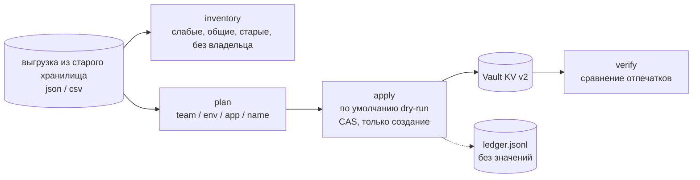

# vault-migration-toolkit

[🇬🇧 English](README.md) | 🇷🇺 **Русский**

[](https://github.com/ftonita/vault-migration-toolkit/actions)


Аккуратный перенос секретов из устаревшего хранилища в **HashiCorp Vault KV v2** с возможностью продолжить с места остановки. Сначала инструмент находит проблемы, затем раскладывает каждый секрет по пути с учётом команды и окружения, записывает с check-and-set и в конце доказывает, что результат совпадает с источником. **Значения секретов никогда не попадают в вывод, логи и отчёты.**

> **Все данные в репозитории синтетические.** Демо-генератор выдаёт заведомо фиктивные значения (`SYNTHETIC-...`). Это эталонная реализация подхода к миграции, применявшегося при внедрении Vault в нескольких командах, а не код или данные какого-либо работодателя.

## Как это работает



| Шаг | Что гарантирует |
|---|---|
| `inventory` | Не требует доступа к Vault. Находит слабые значения, **одно и то же значение в разных окружениях** (высокая критичность, если среди них prod), дубликаты, давно не ротированные секреты и секреты без владельца. Сравнение идёт по HMAC-отпечаткам, значения не выводятся. |
| `plan` | Детерминированное сопоставление `kv-<team>/<env>/<app>/<name>` с алиасами команд и окружений и владельцем по приложению на случай, если команда не указана. Всё неоднозначное (нет команды, неизвестное окружение, два секрета на один путь) уходит в **ручную очередь**, а не угадывается. |
| `apply` | **Без `--execute` это пробный прогон (dry run).** Только создание, с check-and-set. Если по целевому пути уже лежит другое значение, это *конфликт*, а не перезапись (перезапись только явно, через `--overwrite`). Повторный запуск идемпотентен: сравнение идёт с тем, что реально лежит в Vault. |
| `verify` | Читает каждый перенесённый секрет обратно и сравнивает отпечатки: `verified / mismatched / missing`. При любом расхождении код возврата ненулевой. |

## Попробовать за две минуты (Vault не нужен)

```bash
pip install .
vault-migrate demo --out data                       # синтетическая выгрузка + правила
vault-migrate inventory --source data/legacy.json --state st --today 2026-10-08
A="--source data/legacy.json --rules data/rules.yml --state st --backend fake:st/fake-vault.json"
vault-migrate apply  $A                             # пробный прогон
vault-migrate apply  $A --execute --create-mounts
vault-migrate apply  $A --execute                   # повторно: ничего не меняется
vault-migrate verify $A
```

Сокращённый вывод этого прогона на встроенных синтетических данных (38 записей):

```
inventory: 9 findings (high 2, medium 5, low 2)
  high    shared_across_envs  S033, S034  same value in orders/prod/smtp_password, orders/stage/smtp_password
  high    weak                S031        admin_password (orders/prod)
  ...
plan:   36 mapped, 2 in the manual queue (S037 no owning team, S038 environment 'uat')

DRY RUN (nothing written; add --execute): written=0 would_write=36 skipped=0 conflicts=0 failed=0 manual_queue=2
EXECUTED: written=36 would_write=0 skipped=0 conflicts=0 failed=0 manual_queue=2
EXECUTED: written=0 would_write=0 skipped=36 conflicts=0 failed=0 manual_queue=2
verified=36 mismatched=0 missing=0 manual_queue=2
# кто-то вручную изменил один секрет в Vault:
verified=35 mismatched=1 missing=0        mismatch: S008          (exit 1)
EXECUTED: ... skipped=35 conflicts=1      conflict: S008          (exit 1, ничего не перезаписано)
EXECUTED: written=1 ... (с --overwrite)
verified=36 mismatched=0 missing=0
```

## Перенос своих секретов

Кратчайший путь от старого хранилища до проверенного Vault. Подробности по каждому шагу — по ссылкам.

**1. Превратите источник в выгрузку.** Инструмент читает плоский JSON/CSV-список секретов ([формат и примеры](docs/SOURCES.ru.md#1-формат-выгрузки)). Используйте готовый адаптер, рецепт или просто переименуйте колонки CSV:

| Ваш источник | Как получить выгрузку |
|---|---|
| Файлы `.env` вида `<team>/<app>/<env>.env` | `python examples/adapters/env_files.py secrets/ --out legacy.json` |
| Вложенный JSON / YAML-конфиг | `python examples/adapters/nested_json.py config.json --out legacy.json` |
| Kubernetes Secrets | `kubectl get secrets -A -o json \| python examples/adapters/k8s_secrets.py - --out legacy.json` |
| AWS Secrets Manager, CSV из менеджера паролей | [рецепты](docs/SOURCES.ru.md#3-рецепты-для-других-источников) |
| Таблица / любой CSV | переименуйте заголовок в `id,name,value,app,env,team,kind,last_rotated,consumers` |
| Что-то другое | [адаптер на 20 строк](docs/SOURCES.ru.md#4-свой-адаптер) |

Минимальная запись (`id`, `name`, `value` обязательны; `team`, `env`, `app` определяют целевой путь):

```json
{"id": "LEG-0001", "name": "db_password", "value": "...", "app": "orders", "env": "production",
 "team": "Payments Team", "kind": "db_password", "last_rotated": "2026-08-14", "consumers": ["orders-api"]}
```

**2. Опишите правила сопоставления.** Возьмите за основу [`examples/rules.yml`](examples/rules.yml) и правьте, запуская `plan`, пока в ручной очереди не останутся только записи, которым действительно нужен человек:

```yaml
mount_prefix: kv-                       # kv-<team>/<env>/<app>/<name>
allowed_envs: [dev, stage, prod]
team_aliases: { "Payments Team": payments }
env_aliases:  { production: prod, staging: stage }
app_owners:   { reports: platform }     # владелец, если у записи нет команды
```

```bash
vault-migrate inventory --source legacy.json --state migration-state --out inventory.md   # Vault не нужен
vault-migrate plan      --source legacy.json --rules rules.yml --out plan.md
```

**3. Подготовьте Vault.** Загрузите [`examples/vault/migration-policy.hcl`](examples/vault/migration-policy.hcl) (по блоку на каждый mount команды), выпустите короткоживущий токен и создайте mount'ы `kv-<team>` или разрешите `--create-mounts` ([подробно](docs/VAULT.ru.md#3-подготовка-рабочего-vault)). Сначала отрепетируйте на локальном dev-Vault: `docker compose -f examples/vault/docker-compose.yml up -d`.

**4. Перенесите и проверьте.**

```bash
export VAULT_ADDR=https://vault.example.com VAULT_TOKEN=...     # только https (http разрешён лишь для localhost)
A="--source legacy.json --rules rules.yml --state migration-state --backend http"
vault-migrate apply  $A                       # пробный прогон
vault-migrate apply  $A --execute             # добавьте --create-mounts, если токену можно создавать mount'ы
vault-migrate verify $A                       # код 0 = каждый секрет в Vault совпадает с выгрузкой
```

**5. Переключите потребителей и приберитесь.** Приложения читают `kv-<team>/data/<env>/<app>/<name>` → `.data.data.value` ([примеры для CLI, API, Vault Agent, Kubernetes](docs/VAULT.ru.md#6-переключение-приложений-на-vault)). Отзовите токен миграции и уничтожьте выгрузку ([откат и очистка](docs/VAULT.ru.md#7-откат-и-очистка)).

## Документация

| Документ | Содержание |
|---|---|
| [docs/SOURCES.ru.md](docs/SOURCES.ru.md) | Формат выгрузки по полям, адаптеры, рецепты для других хранилищ, как написать свой адаптер |
| [docs/VAULT.ru.md](docs/VAULT.ru.md) | Что пишется в Vault, mount'ы, политика токена, запуск и продолжение после сбоя, проверка через `vault` CLI, потребители, откат, разбор ошибок |
| [examples/](examples) | Пример выгрузки `legacy.json` / `legacy.csv`, `rules.yml`, адаптеры с примерами входных данных, политики Vault, compose-файл локального Vault |

## Безопасность

- Обёртка `Secret`: `repr`/`str`/f-строки всегда дают `Secret(<redacted>)`; значение раскрывается только в единственном месте — при записи.
- Журнал (ledger) и отчёты содержат только id, пути и 8-символьные отпечатки с ключом. HMAC-ключ случайный для каждой миграции и хранится с правами `0600` в каталоге состояния.
- Для нелокальных адресов Vault обязателен TLS; ответы 5xx и сетевые ошибки повторяются с задержкой.
- Сама выгрузка из старого хранилища — открытый текст: держите её на зашифрованном томе и уничтожьте после успешного `verify`.

## Что проверено

Воспроизвести: `pip install -e ".[dev]" && pytest` (75 тестов, покрытие строк 98%):

- Модульные тесты разбора, маскирования, отпечатков, правил, анализа, планирования, миграции (dry-run, идемпотентность, конфликты, перезапись с CAS, частичный сбой и продолжение) и содержимого журнала.
- HTTP-клиент тестируется по настоящему HTTP против `tests/stub_vault.py` — **заглушки, реализующей только используемое подмножество KV v2** (data, metadata, mounts, CAS, 5xx, 403). Это не Vault, поэтому такие вещи, как права на mount'ы и точный текст ошибки CAS, взяты из документации API.
- Сквозной прогон CLI на синтетических данных, включая ручную порчу и восстановление (вывод выше).
- `examples/`: JSON- и CSV-примеры загружаются в одинаковые записи, план по примеру совпадает с документацией, выгрузка каждого адаптера без остатка проходит `plan` (одна — ещё и `apply` и `verify`).
- CI-задача `real-vault` прогоняет весь процесс (`apply --execute --create-mounts`, повторный идемпотентный запуск, `verify`) против **настоящего Vault 1.17 в dev-режиме**; первый прогон прошёл 2026-10-09. Там же `examples/` прогоняется с **не-root токеном**, ограниченным `examples/vault/migration-policy.hcl`.

**Не проверено:** namespace'ы Vault Enterprise, Vault в боевой конфигурации (Raft, методы аутентификации кроме токенов), очень большие выгрузки (выгрузка целиком держится в памяти) и источники, отличные от KV. Пользовательские метаданные пишутся вторым запросом, поэтому запись не атомарна со значением.
