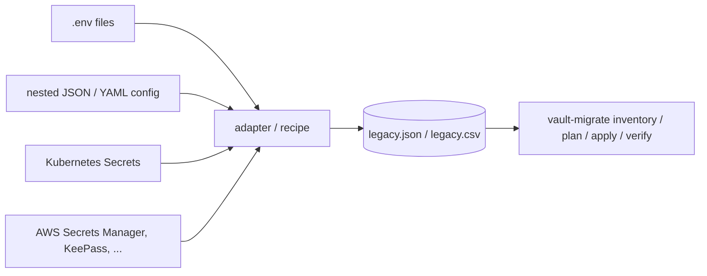

# Connecting a source

🇬🇧 **English** | [🇷🇺 Русский](SOURCES.ru.md)

`vault-migrate` reads exactly one input: a **legacy export**, which is a flat list of secrets in JSON or CSV. It does not connect to your old secret store itself. To connect a source, you turn whatever it stores into this export, using a ready adapter, a one-line recipe or a 20-line script of your own. Everything after that (`inventory`, `plan`, `apply`, `verify`) is the same for every source.



## 1. The export format

Working samples: [`examples/legacy.json`](../examples/legacy.json) and [`examples/legacy.csv`](../examples/legacy.csv) (the same 10 records in both formats).

```json
[
  {
    "id": "LEG-0001",
    "name": "db_password",
    "value": "SYNTHETIC-db-9f2c41d07a6e4b1c8d35",
    "app": "orders",
    "env": "prod",
    "team": "payments",
    "kind": "db_password",
    "last_rotated": "2026-08-14",
    "consumers": ["orders-api", "orders-worker"]
  }
]
```

| Field | Required | Meaning | Used for |
|---|---|---|---|
| `id` | **yes** | Unique, **stable** identifier of the record in the old store | Ledger, reports, `legacy_id` in Vault metadata. Keep it identical when you regenerate the export, otherwise a resumed run cannot match records with the ledger. |
| `name` | **yes** | Secret name | Last path segment: `.../<name>` |
| `value` | **yes** | The secret itself (string) | Written to Vault as the `value` key. Never printed. |
| `app` | for mapping | Application / service | Path segment `<env>/<app>/<name>`; key for `app_owners` |
| `env` | for mapping | Environment, any spelling (`production`, `staging`, ...) | Normalised with `env_aliases`, then checked against `allowed_envs` |
| `team` | for mapping | Owning team, any spelling | Mount `kv-<team>`; normalised with `team_aliases`; if empty, `app_owners` is used |
| `kind` | no (default `password`) | `db_password`, `api_key`, `token`, ... | Vault `custom_metadata.kind` |
| `last_rotated` | no | `YYYY-MM-DD` | Staleness finding; `custom_metadata.last_rotated` |
| `consumers` | no | Who uses the secret: JSON list, or a `;`-separated string (CSV) | Informational, for your cut-over plan |

Rules the loader enforces (`src/vault_migration/sources.py`):

- The file is a `.csv` (by extension) or JSON; JSON must be a **list** of objects.
- `id`, `name` and `value` must be non-empty; `id` must be unique.
- `last_rotated` must be an ISO date or empty.
- Values are strings. One record is one Vault secret with one key, `value`. If your source has multi-key secrets (`username` + `password`), export one record per key (the adapters and the AWS recipe below do this).
- Records without a resolvable team or with an unknown environment are **not** an error: `plan` puts them in the manual queue.

Check an export without touching Vault:

```bash
vault-migrate inventory --source legacy.json --state state     # parses everything, reports problems
vault-migrate plan      --source legacy.json --rules rules.yml # shows every target path + manual queue
```

## 2. Ready adapters

Stdlib-only scripts in [`examples/adapters/`](../examples/adapters). Each writes a valid export (file created with mode `0600`), prints only a record count and never prints values. Every adapter has a sample input in `examples/adapters/samples/`, and `tests/test_examples.py` runs each adapter's output through `plan`.

### `.env` files: `env_files.py`

Layout `<root>/<team>/<app>/<env>.env`, one `KEY=VALUE` per line (`export`, quotes and comments are handled):

```
secrets/
  payments/orders/prod.env      DB_PASSWORD=...
  payments/orders/stage.env
  platform/gateway/prod.env
```

```bash
python examples/adapters/env_files.py secrets/ --exclude '*_HOST' --exclude '*_PORT' --out legacy.json
# --rotated-from-mtime  use the file modification date as last_rotated (best effort)
```

Result: `id = env:payments/orders/prod/DB_PASSWORD`, `name = db_password`, target `kv-payments/prod/orders/db_password`. Use `--exclude` (glob, repeatable) for keys that are configuration, not secrets.

### Nested JSON / YAML config: `nested_json.py`

```json
{"payments": {"orders": {"prod": {"DB_PASSWORD": "...",
                                  "STRIPE_API_KEY": {"value": "...", "kind": "api_key", "last_rotated": "2026-03-01"}}}}}
```

```bash
python examples/adapters/nested_json.py config.json --out legacy.json
python examples/adapters/nested_json.py config.json --levels env,team,app --out legacy.json  # other nesting order
yq -o=json secrets.yml | python examples/adapters/nested_json.py - --out legacy.json         # YAML via yq
```

A leaf is a string or an object with `value` and optional `kind`, `last_rotated`, `consumers`.

### Kubernetes Secrets: `k8s_secrets.py`

```bash
kubectl get secrets -A -o json > k8s-secrets.json
python examples/adapters/k8s_secrets.py k8s-secrets.json \
  --env-map payments-prod=prod --env-map payments-stage=stage --out legacy.json
shred -u k8s-secrets.json
```

| Record field | Taken from |
|---|---|
| `team` | label `team` (`--team-label` to change) |
| `app` | label `app.kubernetes.io/name`, else `app`, else the Secret name |
| `env` | `--env-map NAMESPACE=ENV`, else label `env` (`--env-label`), else the namespace |
| `name` | data key; each key of a Secret is a separate record |

Service-account tokens, Helm release secrets and `dockerconfigjson` secrets are skipped. Non-UTF-8 values are skipped and reported by id.

## 3. Recipes for other sources

Run all of them with `umask 077` on an encrypted volume: the output is plaintext.

### AWS Secrets Manager (naming `<env>/<team>/<app>/<name>`)

```bash
umask 077
aws secretsmanager list-secrets --query 'SecretList[].Name' --output text | tr '\t' '\n' |
while read -r name; do
  aws secretsmanager get-secret-value --secret-id "$name" --query '{name: Name, value: SecretString}' --output json
done |
jq -s '[.[] | . as $s | ($s.name | split("/")) as $p
  | (($s.value | fromjson? | objects) // {($p[3]): $s.value} | to_entries[]) as $kv
  | {id: ("aws:" + $s.name + "#" + $kv.key), env: $p[0], team: $p[1], app: $p[2],
     name: $kv.key, value: ($kv.value | tostring)}]' > legacy.json
```

A plain-string secret becomes one record; a JSON secret (`{"username": ..., "password": ...}`) becomes one record per key. If your names follow another convention, change the `$p[...]` indexes.

### Password manager CSV (KeePassXC: `Group` = `Root/<team>/<app>/<env>`)

```python
# keepass_to_legacy.py  ->  python keepass_to_legacy.py export.csv > legacy.json
import csv, json, sys

rows = []
for r in csv.DictReader(open(sys.argv[1], encoding="utf-8")):
    _, team, app, env = r["Group"].split("/")
    rows.append({
        "id": f"kp:{r['Group']}/{r['Title']}",
        "name": r["Title"], "value": r["Password"],
        "team": team, "app": app, "env": env,
        "last_rotated": r["Last Modified"][:10],
    })
json.dump(rows, sys.stdout, indent=2)
```

### A spreadsheet or any CSV

If the columns can be renamed to `id,name,value,app,env,team,kind,last_rotated,consumers`, no code is needed: rename the header row and pass the `.csv` directly. Missing optional columns may be omitted.

## 4. Writing your own adapter

Any program that writes the JSON above works. The pattern used by the bundled adapters:

1. Read the source (API dump, files, database query).
2. For each secret value, emit one record. Derive `id` from the source's own key (path, ARN, row id) so it is **stable** across re-exports.
3. Put the source's grouping into `team` / `app` / `env` as they are; do not normalise. Spelling differences belong in `rules.yml` (`team_aliases`, `env_aliases`), where they are reviewed in one place.
4. Never print values; print counts and ids only. Create the output file `0600`.
5. Run `vault-migrate plan` and iterate on `rules.yml` until the manual queue holds only records that really need a human.

`examples/adapters/_common.py` (`record()` and `write_export()`) can be reused as is.

## 5. Handling the export safely

- Generate it on an encrypted volume with `umask 077`; never commit it (add it to `.gitignore`).
- Keep it until `verify` passes, then `shred -u legacy.json`.
- `inventory` and `plan` need no Vault access, so you can review findings and the target layout with the owners first.
