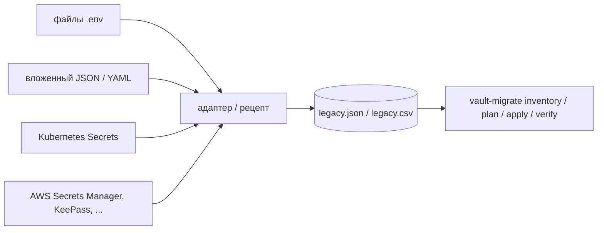

# Подключение источника

[🇬🇧 English](SOURCES.md) | 🇷🇺 **Русский**

`vault-migrate` читает ровно один вход — **выгрузку из старого хранилища (legacy export)**: плоский список секретов в JSON или CSV. К старому хранилищу инструмент сам не подключается. «Подключить источник» значит превратить то, что в нём лежит, в такую выгрузку: готовым адаптером, однострочным рецептом или собственным скриптом на 20 строк. Всё остальное (`inventory`, `plan`, `apply`, `verify`) одинаково для любого источника.



## 1. Формат выгрузки

Рабочие примеры: [`examples/legacy.json`](../examples/legacy.json) и [`examples/legacy.csv`](../examples/legacy.csv) (одни и те же 10 записей в двух форматах).

```json
[
  {
    "id": "LEG-0001",
    "name": "db_password",
    "value": "SYNTHETIC-db-9f2c41d07a6e4b1c8d35",
    "app": "orders",
    "env": "prod",
    "team": "payments",
    "kind": "db_password",
    "last_rotated": "2026-08-14",
    "consumers": ["orders-api", "orders-worker"]
  }
]
```

| Поле | Обязательно | Смысл | Где используется |
|---|---|---|---|
| `id` | **да** | Уникальный и **стабильный** идентификатор записи в старом хранилище | Журнал, отчёты, `legacy_id` в метаданных Vault. При повторной выгрузке id должен остаться тем же, иначе продолженный запуск не сопоставит записи с журналом. |
| `name` | **да** | Имя секрета | Последний сегмент пути: `.../<name>` |
| `value` | **да** | Сам секрет (строка) | Пишется в Vault в ключ `value`. Никогда не выводится. |
| `app` | для сопоставления | Приложение / сервис | Сегмент пути `<env>/<app>/<name>`; ключ для `app_owners` |
| `env` | для сопоставления | Окружение в любом написании (`production`, `staging`, ...) | Нормализуется через `env_aliases`, затем сверяется с `allowed_envs` |
| `team` | для сопоставления | Команда-владелец в любом написании | Mount `kv-<team>`; нормализуется через `team_aliases`; если пусто — берётся `app_owners` |
| `kind` | нет (по умолчанию `password`) | `db_password`, `api_key`, `token`, ... | `custom_metadata.kind` в Vault |
| `last_rotated` | нет | `YYYY-MM-DD` | Поиск устаревших секретов; `custom_metadata.last_rotated` |
| `consumers` | нет | Кто использует секрет: JSON-список или строка через `;` (CSV) | Справочно, для плана переключения |

Что проверяет загрузчик (`src/vault_migration/sources.py`):

- Файл — `.csv` (по расширению) или JSON; JSON должен быть **списком** объектов.
- `id`, `name` и `value` непустые; `id` уникален.
- `last_rotated` — дата ISO или пусто.
- Значения — строки. Одна запись = один секрет Vault с одним ключом `value`. Если в источнике секрет из нескольких ключей (`username` + `password`), выгружайте по записи на каждый ключ (адаптеры и рецепт для AWS ниже так и делают).
- Запись без определяемой команды или с неизвестным окружением — **не** ошибка: `plan` отправит её в ручную очередь.

Проверить выгрузку, не трогая Vault:

```bash
vault-migrate inventory --source legacy.json --state state     # разбирает всё, сообщает о проблемах
vault-migrate plan      --source legacy.json --rules rules.yml # показывает все целевые пути и ручную очередь
```

## 2. Готовые адаптеры

Скрипты только на стандартной библиотеке в [`examples/adapters/`](../examples/adapters). Каждый пишет корректную выгрузку (файл создаётся с правами `0600`), выводит только число записей и никогда не выводит значения. У каждого есть пример входных данных в `examples/adapters/samples/`, а `tests/test_examples.py` прогоняет результат каждого адаптера через `plan`.

### Файлы `.env`: `env_files.py`

Структура `<root>/<team>/<app>/<env>.env`, по одной строке `KEY=VALUE` (`export`, кавычки и комментарии поддерживаются):

```
secrets/
  payments/orders/prod.env      DB_PASSWORD=...
  payments/orders/stage.env
  platform/gateway/prod.env
```

```bash
python examples/adapters/env_files.py secrets/ --exclude '*_HOST' --exclude '*_PORT' --out legacy.json
# --rotated-from-mtime  взять дату изменения файла как last_rotated (приблизительно)
```

Результат: `id = env:payments/orders/prod/DB_PASSWORD`, `name = db_password`, путь `kv-payments/prod/orders/db_password`. `--exclude` (glob, можно несколько раз) отсекает ключи, которые являются конфигурацией, а не секретами.

### Вложенный JSON / YAML-конфиг: `nested_json.py`

```json
{"payments": {"orders": {"prod": {"DB_PASSWORD": "...",
                                  "STRIPE_API_KEY": {"value": "...", "kind": "api_key", "last_rotated": "2026-03-01"}}}}}
```

```bash
python examples/adapters/nested_json.py config.json --out legacy.json
python examples/adapters/nested_json.py config.json --levels env,team,app --out legacy.json  # другой порядок вложенности
yq -o=json secrets.yml | python examples/adapters/nested_json.py - --out legacy.json         # YAML через yq
```

Лист — строка или объект с `value` и необязательными `kind`, `last_rotated`, `consumers`.

### Kubernetes Secrets: `k8s_secrets.py`

```bash
kubectl get secrets -A -o json > k8s-secrets.json
python examples/adapters/k8s_secrets.py k8s-secrets.json \
  --env-map payments-prod=prod --env-map payments-stage=stage --out legacy.json
shred -u k8s-secrets.json
```

| Поле записи | Откуда берётся |
|---|---|
| `team` | метка `team` (меняется через `--team-label`) |
| `app` | метка `app.kubernetes.io/name`, иначе `app`, иначе имя Secret |
| `env` | `--env-map NAMESPACE=ENV`, иначе метка `env` (`--env-label`), иначе namespace |
| `name` | ключ в `data`; каждый ключ Secret — отдельная запись |

Токены service account, секреты релизов Helm и `dockerconfigjson` пропускаются. Значения не в UTF-8 пропускаются, в stderr выводится только их id.

## 3. Рецепты для других источников

Запускайте их с `umask 077` на зашифрованном томе: результат — открытый текст.

### AWS Secrets Manager (имена вида `<env>/<team>/<app>/<name>`)

```bash
umask 077
aws secretsmanager list-secrets --query 'SecretList[].Name' --output text | tr '\t' '\n' |
while read -r name; do
  aws secretsmanager get-secret-value --secret-id "$name" --query '{name: Name, value: SecretString}' --output json
done |
jq -s '[.[] | . as $s | ($s.name | split("/")) as $p
  | (($s.value | fromjson? | objects) // {($p[3]): $s.value} | to_entries[]) as $kv
  | {id: ("aws:" + $s.name + "#" + $kv.key), env: $p[0], team: $p[1], app: $p[2],
     name: $kv.key, value: ($kv.value | tostring)}]' > legacy.json
```

Секрет-строка даёт одну запись; JSON-секрет (`{"username": ..., "password": ...}`) — по записи на ключ. Если имена устроены иначе, поменяйте индексы `$p[...]`.

### CSV из менеджера паролей (KeePassXC: `Group` = `Root/<team>/<app>/<env>`)

```python
# keepass_to_legacy.py  ->  python keepass_to_legacy.py export.csv > legacy.json
import csv, json, sys

rows = []
for r in csv.DictReader(open(sys.argv[1], encoding="utf-8")):
    _, team, app, env = r["Group"].split("/")
    rows.append({
        "id": f"kp:{r['Group']}/{r['Title']}",
        "name": r["Title"], "value": r["Password"],
        "team": team, "app": app, "env": env,
        "last_rotated": r["Last Modified"][:10],
    })
json.dump(rows, sys.stdout, indent=2)
```

### Таблица или любой CSV

Если колонки можно переименовать в `id,name,value,app,env,team,kind,last_rotated,consumers`, код не нужен: поправьте строку заголовка и передайте `.csv` напрямую. Необязательные колонки можно не указывать.

## 4. Свой адаптер

Подойдёт любая программа, которая пишет JSON в формате выше. Схема, по которой сделаны встроенные адаптеры:

1. Прочитать источник (дамп API, файлы, запрос к БД).
2. На каждое значение секрета выдать одну запись. `id` строить из собственного ключа источника (путь, ARN, id строки), чтобы он был **стабильным** между выгрузками.
3. Класть группировку источника в `team` / `app` / `env` как есть, без нормализации. Разночтения в написании описываются в `rules.yml` (`team_aliases`, `env_aliases`) — там их проще проверить в одном месте.
4. Никогда не выводить значения, только количество и id. Создавать файл с правами `0600`.
5. Запускать `vault-migrate plan` и править `rules.yml`, пока в ручной очереди не останутся только записи, которым действительно нужен человек.

`examples/adapters/_common.py` (`record()` и `write_export()`) можно переиспользовать как есть.

## 5. Безопасное обращение с выгрузкой

- Создавайте её на зашифрованном томе с `umask 077`; никогда не коммитьте (добавьте в `.gitignore`).
- Храните до успешного `verify`, затем `shred -u legacy.json`.
- `inventory` и `plan` не обращаются к Vault, поэтому находки и целевую структуру можно сначала согласовать с владельцами секретов.
